# 알고리즘 스터디 10주 📃

매주 수요일에 문제를 업데이트하고, 일요일까지 문제 풀고, 그 다음 주 화요일까지 `Pull Request`에 코멘트를 작성  
사용 언어 : C, Python

## 목차

1. [준비물 🗂](#준비물-)
2. [방법 📁](#방법-)
3. [소스 코드 및 파일 이름 작성법 ✏️](#소스-코드-및-파일-이름-작성법-%EF%B8%8F)
4. [`commit` 방법 ✏️](#commit-방법-%EF%B8%8F)
5. [`Pull Request` 방법 ✏️](#pull-request-방법-%EF%B8%8F)
6. [코드 리뷰(코멘트) 방법 📝](#코드-리뷰코멘트-방법-)
7. [~ 주차 문제 📚](#-주차-문제-)
8. [하는 방법 자세히 ✏️](#하는-방법-자세히-%EF%B8%8F)

</br>

## 준비물 🗂

1. 이것이 코딩 테스트다 with 파이썬 (나동빈)
2. Github 계정
3. [백준 온라인 저지](https://acmicpc.net) 계정

## 방법 📁

1. 이 저장소를 `fork` 하기
2. `fork` 한 저장소에 자신의 이름으로 폴더 하나 만들기
3. 자신의 폴더 안에 소스코드를 `commit`, 업로드 하기
4. `fork`한 저장소를 이 저장소로 `Pull Request` 하기
5. 다른 사람들의 `Pull Request`을 보면서 코드 리뷰 하기
6. 꼭!! 기한 내에 하기!!

## 소스 코드 및 파일 이름 작성법 ✏️

-   소스 코드에 주석을 추가해서 다른 사람이 쉽게 이해할 수 있도록 하기
-   이름_주차_몇번째문제  
    예시
    > jinyeong_week2_3.c  
    > jinyeong_week1_2.py

## `commit` 방법 ✏️

-   이름_주차_몇번째문제_사용 언어  
    예시
    > jinyeong_week5_3_python  
    > jinyeong_week3_2_c

## `Pull Request` 방법 ✏️

1. Github 홈페이지 `fork` 한 저장소에서 `Create pull request` 누르기
2. 제목은 `이름_주차`로 하기

-   제목 예시
    > jinyeong_week2   


## 코드 리뷰(코멘트) 방법 📝

**가장 중요!! 자신의 실력을 발전시킬 수 있는 부분!! 꼭 하세요!!**

-   다른 사람의 `Pull Request`를 보고 `comment` 남기기
-   코드의 흐름을 파악하고 어떠한 방식이 사용되었을까 생각하기
-   의견, 궁금한 점 제시하기 (잘한 부분, 피드백 혹은 또 다른 방안 제시, 코드에 대해 궁금한 점 등)   
   
</br>   
   
## ~ 주차 문제 📚

| 주차 | 문제 유형 | 문제(순서대로 1~) |
| :--: | :-------: | :---------------------------------------------------------------------------------------------------------------------------------------------------------------------------------------------------------------------------: |
| 1 | 연습 문제 | [수 정렬하기](https://www.acmicpc.net/problem/2750), [팰린드롬인지 확인하기](https://www.acmicpc.net/problem/10988), [피보나치 수 2](https://www.acmicpc.net/problem/2748), [소수 찾기](https://www.acmicpc.net/problem/2581) |
| 2 | 그리디 |  큰 수의 법칙(p92), 숫자 카드 게임(p96), 1이 될 때까지(p99), [잃어버린 괄호](https://www.acmicpc.net/problem/1541) |
| 3 | 구현 | 왕실의 나이트(p115), 게임 개발(p118), [쉽게 푸는 문제](https://www.acmicpc.net/problem/1292), [회문(팰린드롬)](https://www.acmicpc.net/problem/17609) |
| 4 | DFS/BFS | 음료수 얼려 먹기(p149), 미로 탈출(p152), [DFS와 BFS](https://www.acmicpc.net/problem/1260) |
   
</br>
   
## 하는 방법 자세히 ✏️

---

1. 이 저장소를 `fork` 하기  
   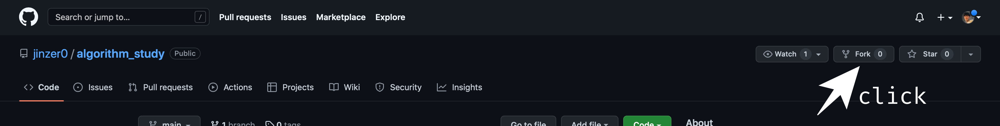
   </br>

---

2. 원하는 디렉토리에 `fork`한 저장소(자신의 깃헙 아이디/algorithm_study) clone 하기

-   cmd 열고 원하는 디렉토리로 이동
-   `fork`한 저장소 clone

```
git clone https://github.com/your github id/algorithm_study.git
```

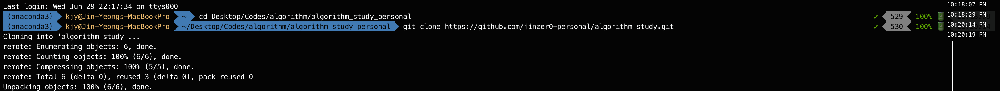  
</br>

---

3. IDE로 `clone` 한 저장소 폴더 열어서 제목이 자신의 이름인 폴더 하나 만들기  
   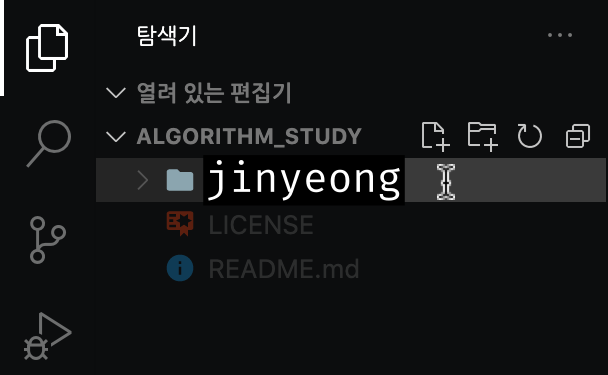
   </br>

---

4. 매 주차 문제 보고 풀기 (문서 중간에 문제 있음!!)  
   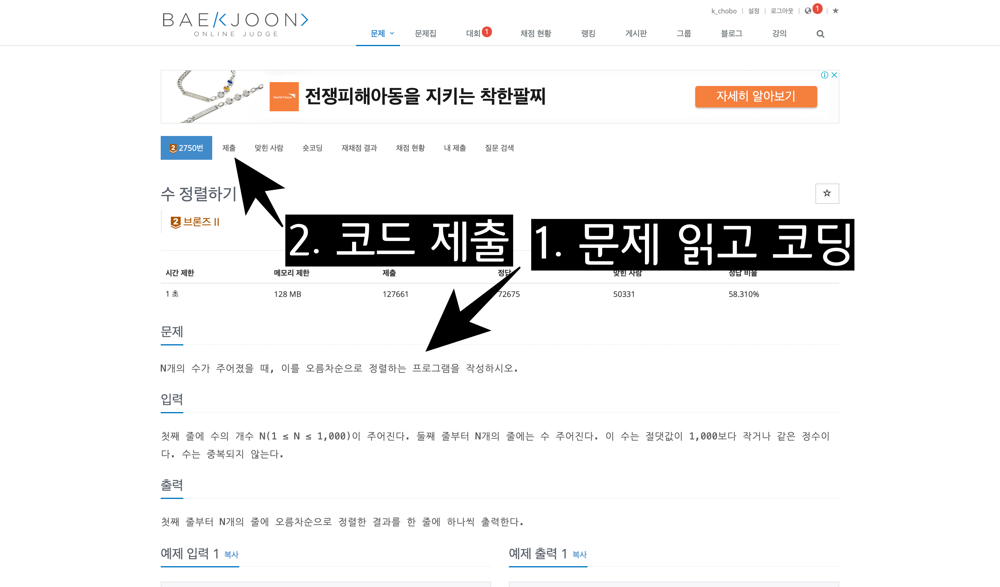  
   </br>

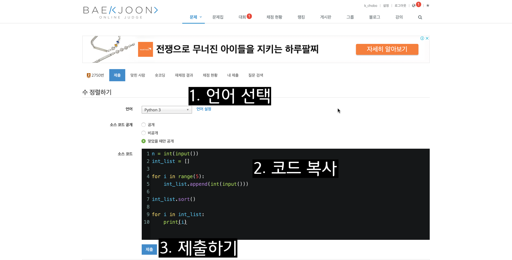  
</br>

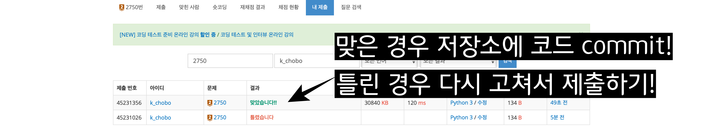
</br>

---

5. 매 문제마다 저장소 `commit`, `push` 하기

```
git add -A
```

```
git commit -m "jinyeong_week2_3_c"
```

```
git push
```

</br>

---

6. 모든 문제를 다 풀고 `commit`, `push` 까지 완료했으면 `Pull Request`!

-   `fork` 한 개인 저장소 페이지 들어가서 `Contribute` 클릭, `Open pull request` 클릭  
    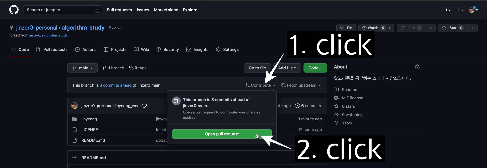  
    </br>

-   `Create pull request` 클릭  
    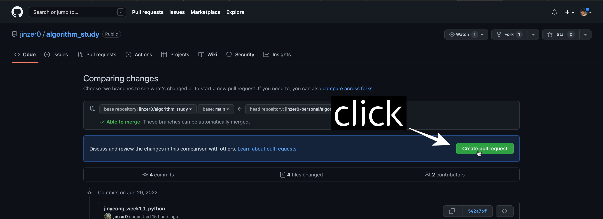  
    </br>

-   양식에 맞게 제목 작성후 하단 `Create pull request` 클릭  
    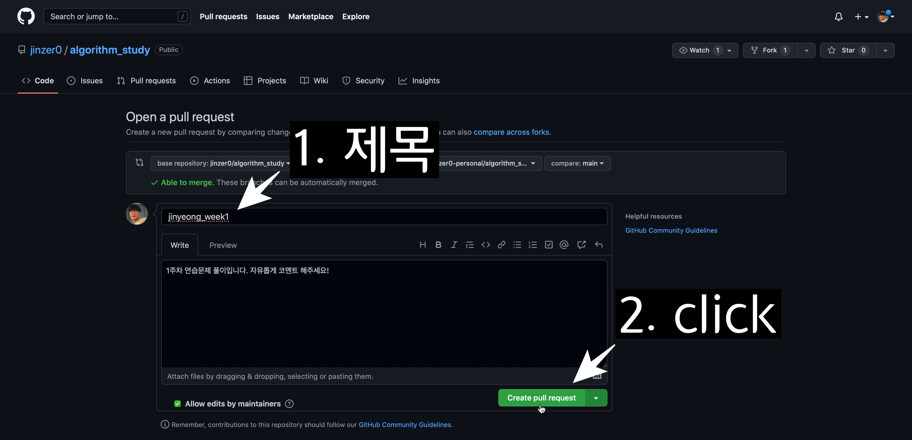
    </br>

---

7. `Code Review` 하기 위해 원 저장소(jinzer0/algorithm_study)로 접속하기

-   Pull request 클릭후 다른 사람의 Pull request 클릭  
    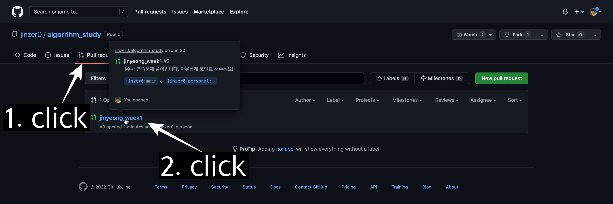  
    </br>

-   의견이나 또 다른 대안, 보완점 작성후 `Finish your review` 클릭
    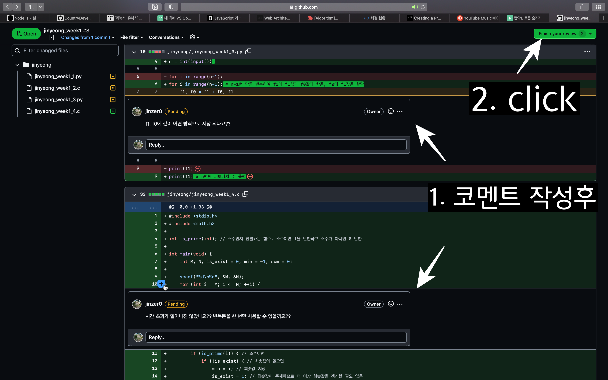
    </br>

-   서로 의견 나누기
    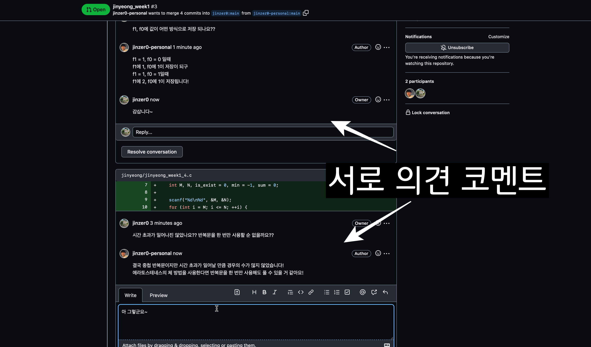
    </br>
